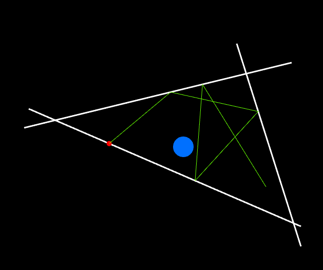

**Readme**
1. How to build and run(ubuntu)

a. Sure that you have all package dependencies
```apt update && sudo apt install -y python3-dev python3-pip libjpeg-dev zlib1g-dev python-gst-1.0```
 
b. make venv, install all python dependencies and run
```
python3 -m venv venv
source venv/bin/activate
pip install -r requirements.txt
python MyGame.py
```
So, now you launched project and probably you're seeing black screen.
How can we achieve similar state as at picture:

 
 Controls:
 * a - clear the room
 * m - create Mirror in 2 clicks. Mirror is a segment with start point at the 1st click and end point at the 2nd click.
 * r - launch a ray. The 1st click defines start point, the 2nd click defines  direction
 * n - update ray coordinates: move the ray to the next mirror
 * w - place the target circle
 * d - delete mirror or target circle
 * s - save current configuration to disk
 * l - load current configuration from disk
 * o - change value of continuous_flag. If this flag is set, the last creation point of the mirror will be remembered and the mirrors will form a closed figure.
